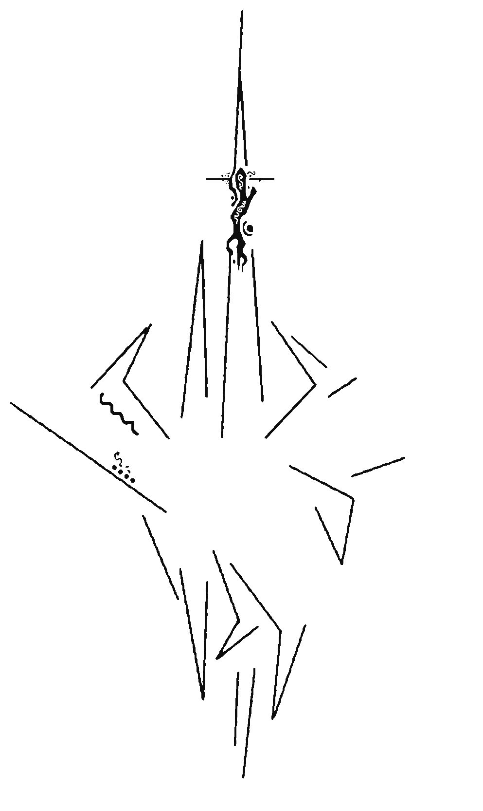

<h1 align="center">
  </img><br>
  Vailyn
  <br>
</h1>

<p align="center">
  <a href="https://github.com/VainlyStrain/Vailyn/blob/master/Vailyn">
    
  </a>
  <a href="https://www.python.org/">
    
  </a><br>
  Path Traversal Attack Tool
</p>

### About

Vailyn is a multi-phased vulnerability analysis and exploitation tool for path traversal/directory climbing vulnerabilities. It is built to make it as performant as possible, and to offer a wide arsenal of filter evasion techniques.

### How does it work?

Vailyn operates in 2 phases. First, it checks if the vulnerability is present. It does so by trying to access /etc/passwd, with all of its evasive payloads. Analysing the response, payloads that worked are separated from the others.

> __Improvement__
>
> Since v1.1, a custom file to check can be specified by argument.

Now, the user can choose freely which payloads to use. Only these payloads will be used in the second phase.

The second phase is the exploitation phase. Now, it tries to leak all possible files from the server using a file and a directory dictionary. The search depth and the directory permutation level can be adapted via arguments. Optionally, it can download found files, and save them in its loot folder.

Right now, it supports multiple attack methods: injection via query and path.

> __New__
>
> Since v1.2, cookie path traversals are supported, too! Use -a 3 for a cookie attack.

### Why the phase separation?

The separation in several phases is new in this version. It is done to hugely improve the performance of the tool. In previous versions, every file-directory combination was checked with every payload. This resulted in a huge overhead due to payloads being always used again, despite they are not working for the current server.

### Installation

Recommended Python version is 3.7+, but it should work fine with prior Python 3 versions, too. To install Vailyn, download the archive from the release tab, or perform

```
$ git clone https://github.com/VainlyStrain/Vailyn
```

Once on your system, you'll need to install the dependencies.

```
$ pip install -r requirements.txt   # --user
```

That's it! Fire Vailyn up by moving to its installation directory and performing

```
$ python Vailyn -h
```

### Usage

Vailyn has 3 mandatory arguments: `-v VIC, -a ACK and -l FIL PATH`. However, depending on `-a`, more arguments may be required.

```
mandatory:
  -v VIC, --victim VIC  Target to attack, part 1 [pre injection point]
  -a ACK, --attack ACK  Attack type (int)[1: query, 2: path, 3:cookie]
  -l FIL PATH, --lists FIL PATH      
                        Dictionaries to use (see templates for syntax)
additional:
  -p PAM, --param PAM   query parameter to use for --attack 1
  -s, --all             display every path tried, even 404s
  -d INT, --depth INT   max. depth of checking and dir permutation level
  -n, --loot            Download found files into the loot folder
  -c INT, --checkdepth INT
                        Max. Depth of checking for phase 1
  -h, --help            show this help menu and exit
  -i FIL, --check FIL   File to check for in Phase 1 (df: /etc/passwd)
  -q VIC2, --vic2 VIC2  Attack Target, part 2 (post injection point)

```

Vailyn currently supports 3 attack vectors. The attack performed is identified by the `-a ACK` argument.

```
ACK        attack
----       -------
1          query-based attack  (https://site.com?file=../../../)
2          path-based attack   (https://site.com/../../../)
3          cookie-based attack (will grab the cookies for you)
```

You also must specify a target to attack. This is done via `-v VIC` and `-q VIC2`, where -v is the part before the injection point, and -q the rest.

Example: if the final URL should look like: `https://site.com/download.php?file=<ATTACK>&param2=necessaryvalue`, you can specify `-v https://site.com/download.php` and `-q &param2=necessaryvalue` (and `-p file`, since this is a query attack).

To perform the bruteforce attack in phase 2, you need to specify 2 dictionaries:
* FIL, containing filenames only (e.g. index.php)
* PATH, containing directory names only. Note that each directory entry MUST end with a "/". Also, Vailyn will handle directory permutation for you, so you'll need only single directories in a row.

#### Phase 1

This is the analysis phase, where working payloads are separated from the others.

By default, `/etc/passwd` is looked up. If the server is not running Linux, you can specify a custom file by `-i FILENAME`. Note that you must include subdirectories in FILENAME.
You can modify the lookup depth with `-c DEPTH` (default=8).

#### Phase 2

This is the exploitation phase, where Vailyn will try to leak as much files as possible.

The depth of lookup in phase 2 (the maximal number of layers traversed back, and the level of subdirectory recursion) is specified by the `-d` argument. In future versions, these properties can be changed independently (using 2 arguments).

By specifying `-n`, Vailyn will not only display files on the terminal, but also download and save the files into the loot folder.

If you want a verbose output (display every output, not only found files), you can use `-s`. Note that output gets really messy, this is basically just a debug help.

### False Positive prevention

To distinguish real results from false positives, Vailyn does the following checks:
* check the status code of the response
* check if the response is identical to one taken before attack start: this is useful e.g, when the server returns 200, but ignores the payload input or returns a default page if the file is not found.
* check for empty responses
* check if common error signatures are in the response content
* check if the payload is contained in the response: this is an additional check for the case the server responds 200 for non-existing files, and reflects the payload in a message like (../../secret not found)

### Possible Issues

Please consider, that I'm still learning. So, there may still be some undetected false positives/negatives. If you found some (or want to point out other bugs/improvements), please leave an issue.
