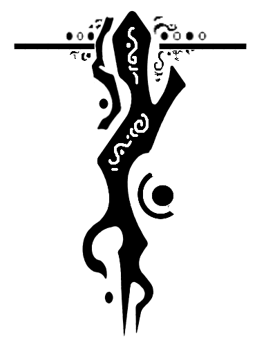

<h1 align="center">
  </img> 
  Vailyn
   
</h1>

  
   
  Path Traversal Attack Tool

### About

Vailyn is a multi-phased vulnerability analysis and exploitation tool for path traversal/directory climbing vulnerabilities. It is built to make it as performant as possible, and to offer a wide arsenal of filter evasion techniques.

### How does it work?

Vailyn operates in 2 phases. First, it checks if the vulnerability is present. It does so by trying to access /etc/passwd, with all of its evasive payloads. Analysing the response, payloads that worked are separated from the others.

Now, the user can choose freely which payloads to use. Only these payloads will be used in the second phase.

The second phase is the exploitation phase. Now, it tries to leak all possible files from the server using a file and a directory dictionary. The search depth and the directory permutation level can be adapted via arguments. Optionally, it can download found files, and save them in its loot folder.

Right now, it supports 2 attack methods: injection via query and path. Cookies are not supported yet.

### Why the phase separation?

The separation in several phases is new in this version. It is done to hugely improve the performance of the tool. In previous versions, every file-directory combination was checked with every payload. This resulted in a huge overhead due to payloads being always used again, despite they are not working for the current server.

### Possible Issues

Please consider, that I'm still learning. So, there may be some false positives/negatives. If you found some (or want to point out other bugs/improvements), please leave an issue.
